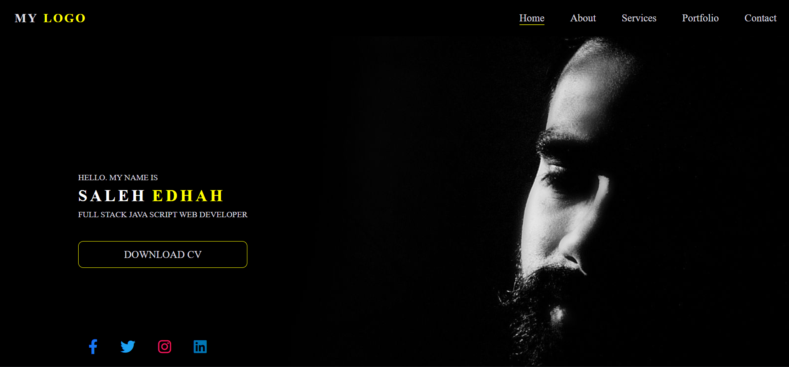
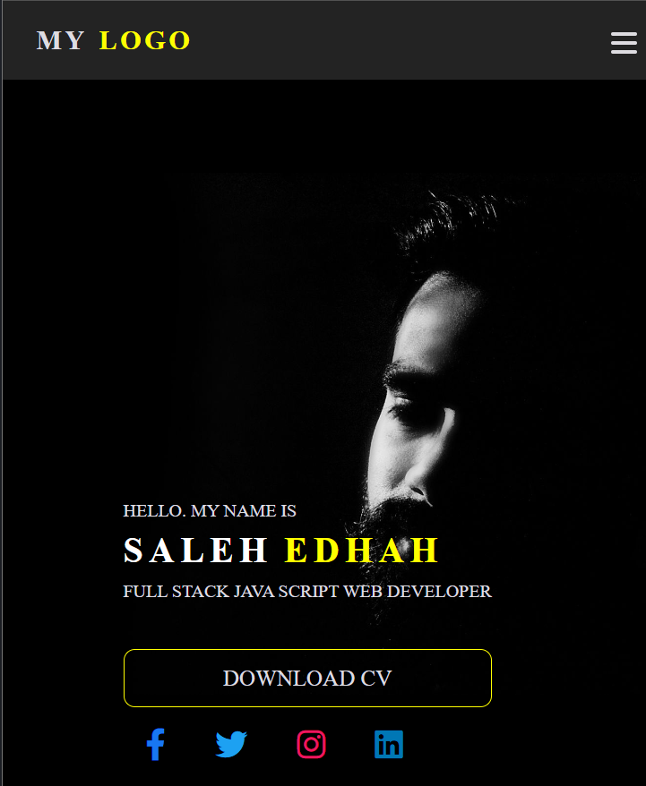
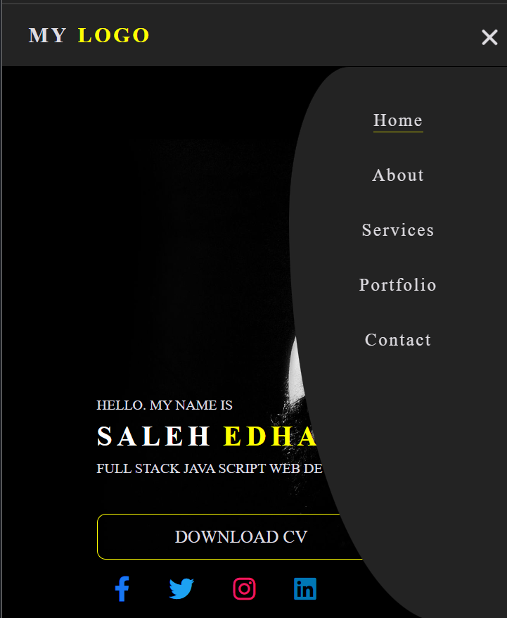

# Portfolio Landing Page
- in this project i have created a portfolio landing page.
- It is Fully responsive.
- in smaller screens You can click the menu bar icon to see the list-items..its done using javascript. 

# Technologies Used

# Output

